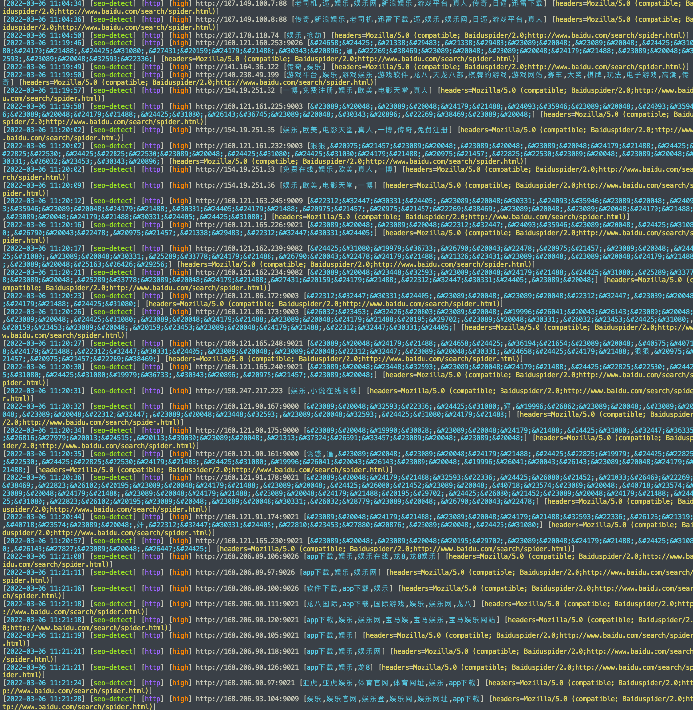

# seo-detect

简单、有效的 seo 关键词检测方案

---

## 开始

**1. 下载**
```bash
git clone https://github.com/ffffffff0x/seo-detect.git
cd seo-detect
```

**2. 安装 nuclei**
```
go install -v github.com/projectdiscovery/nuclei/v2/cmd/nuclei@latest
```

**3. 使用**

```bash
nuclei -duc -ni -t seo-detect.yaml -l target.txt

# -duc 关闭 nuclei 模板自动更新检查
# -ni 禁用 interactsh 服务
# target.txt 是目标列表
```

**效果**



---

> create by ffffffff0x
